# PathoImage Toolkit

### WSI Crop, Tile and Merge Tool for Digital Pathology Images

[](https://doi.org/10.5281/zenodo.20316535)

PathoImage Toolkit is a standalone application for working with large digital pathology and microscopy images. It supports high-resolution ROI cropping, fixed-size tiling, row/column-based image division, and reconstruction of tiled images.

The Windows release is designed to run without a separate Python installation. Linux and macOS artifacts may also be generated through the GitHub Actions build workflow.


---

## Main Features

- Crop high-resolution ROIs from large WSI files.
- Select the full image area automatically for whole-slide export or downsampling.
- Downsample crops before saving.
- Generate fixed-size square tiles with optional overlap.
- Divide images into a user-defined number of rows and columns.
- Bulk tile multiple images with the same parameters.
- Add black or white padding only to true incomplete border tiles.
- Save outputs as TIFF, OME-TIFF, or JPEG depending on mode.
- Merge tiles automatically from names such as `ImageName_A1.tif`, `ImageName_B1.tif`, `ImageName_A2.tif`.
- Merge tiles manually using a row/column grid when filenames do not encode tile position.
- Preserve calibration metadata when available, including DPI and physical pixel size.
- Correctly scale physical pixel size metadata when downsampling crops or tiles.
- Support BigTIFF output and optional lossless DEFLATE compression.
- Include a Help/About dialog with citation, DOI, supported formats, and usage notes.
- Write CSV logs for batch tiling jobs.

---

## Screenshots

### Crop mode

Crop mode allows exact pixel-coordinate ROI extraction and optional interactive rectangle selection from the preview.

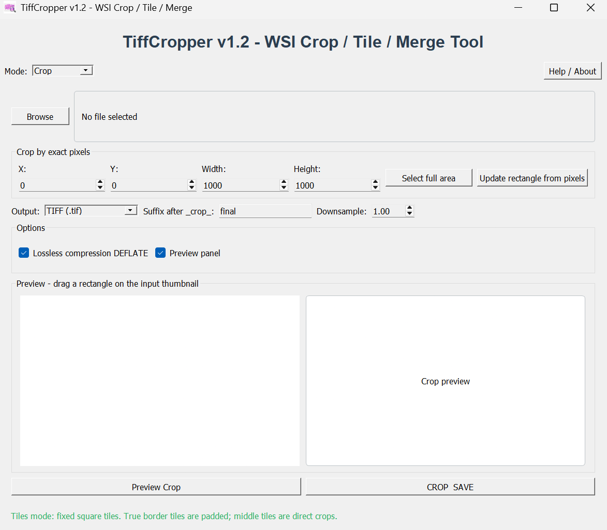

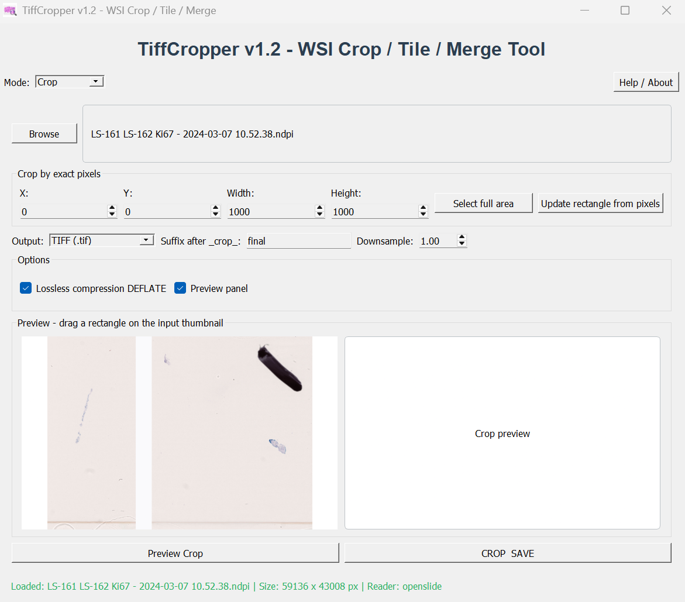

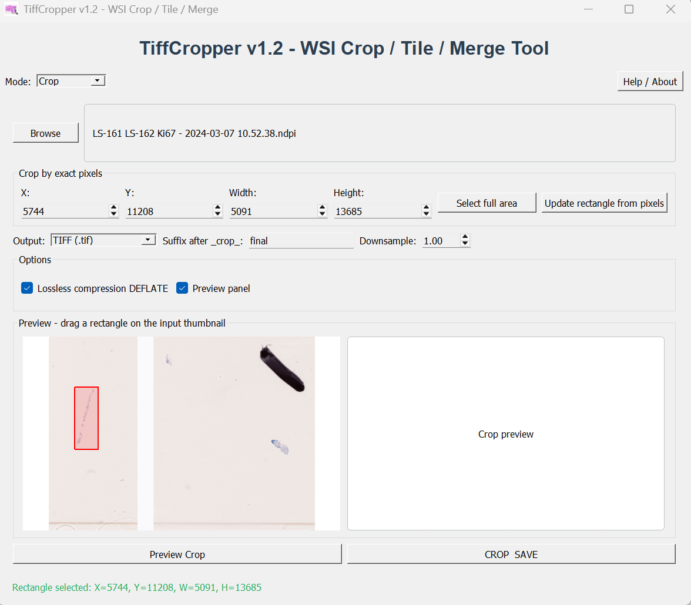

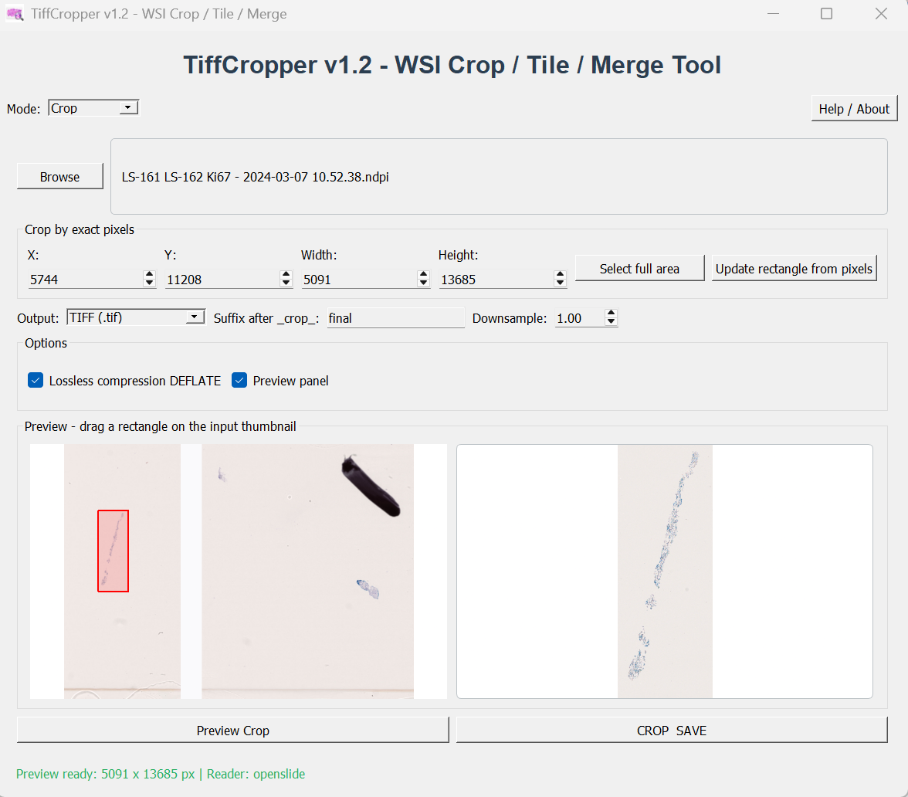

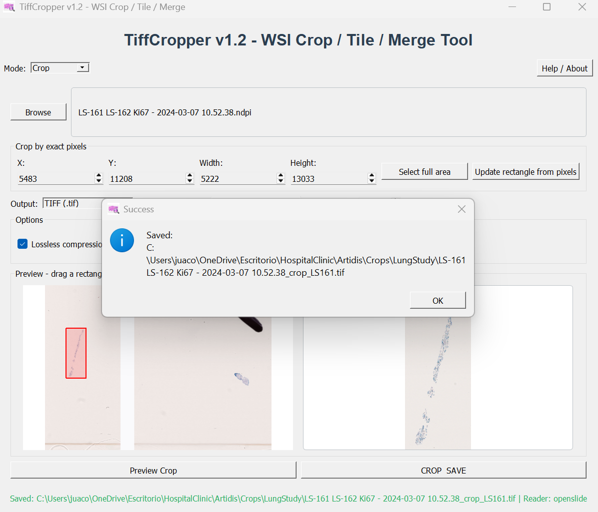

### Tiles mode

Tiles mode supports fixed-size square tiles, optional overlap, downsampling, batch processing, and row/column-based division.

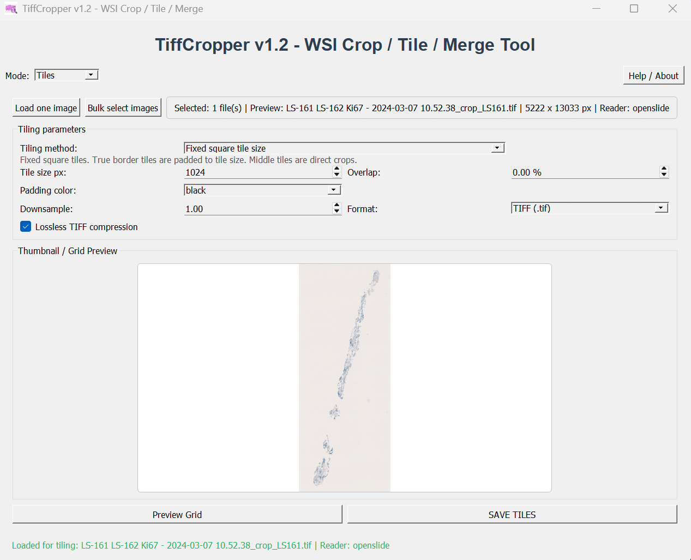

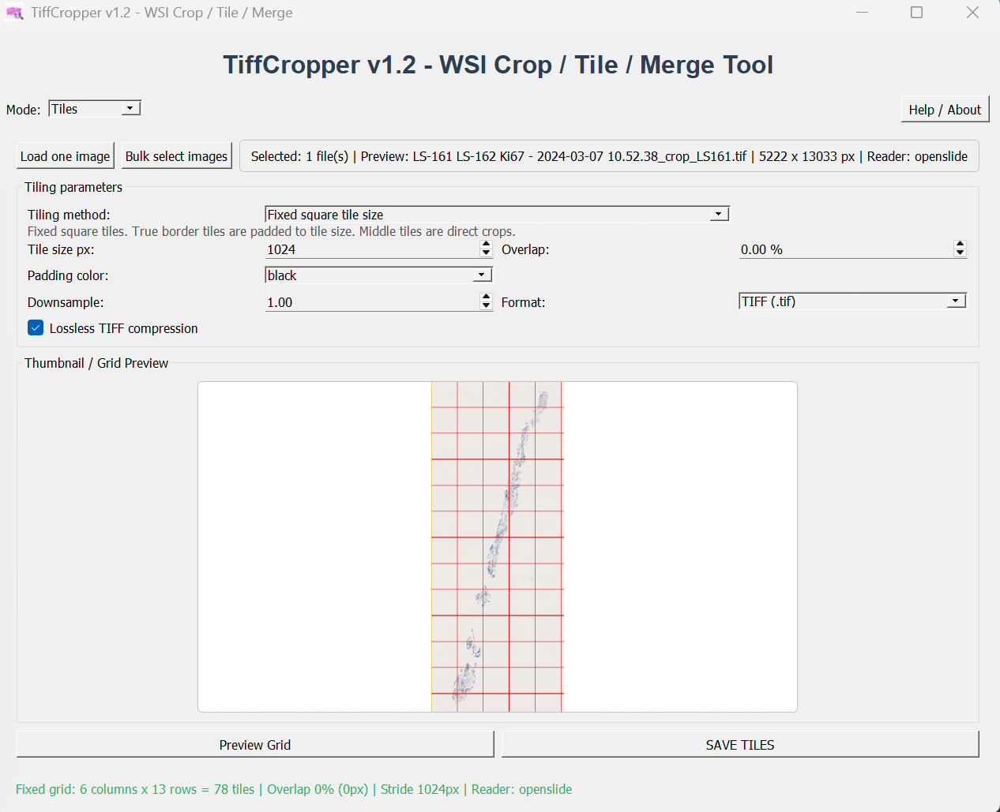

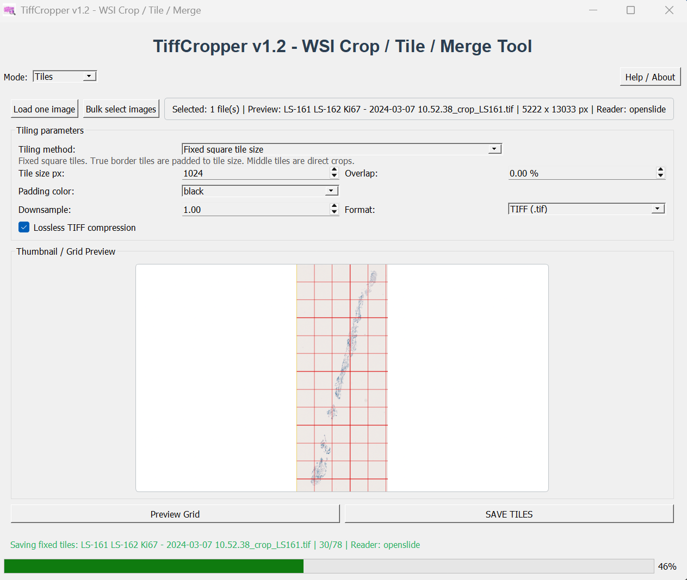

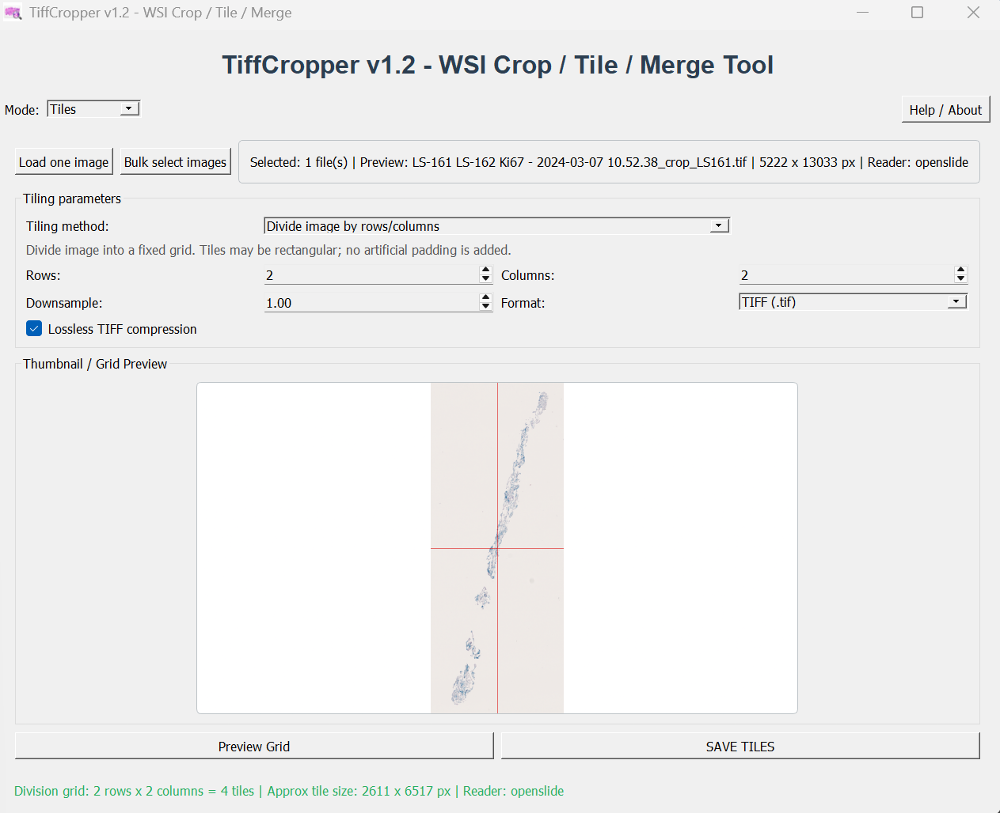

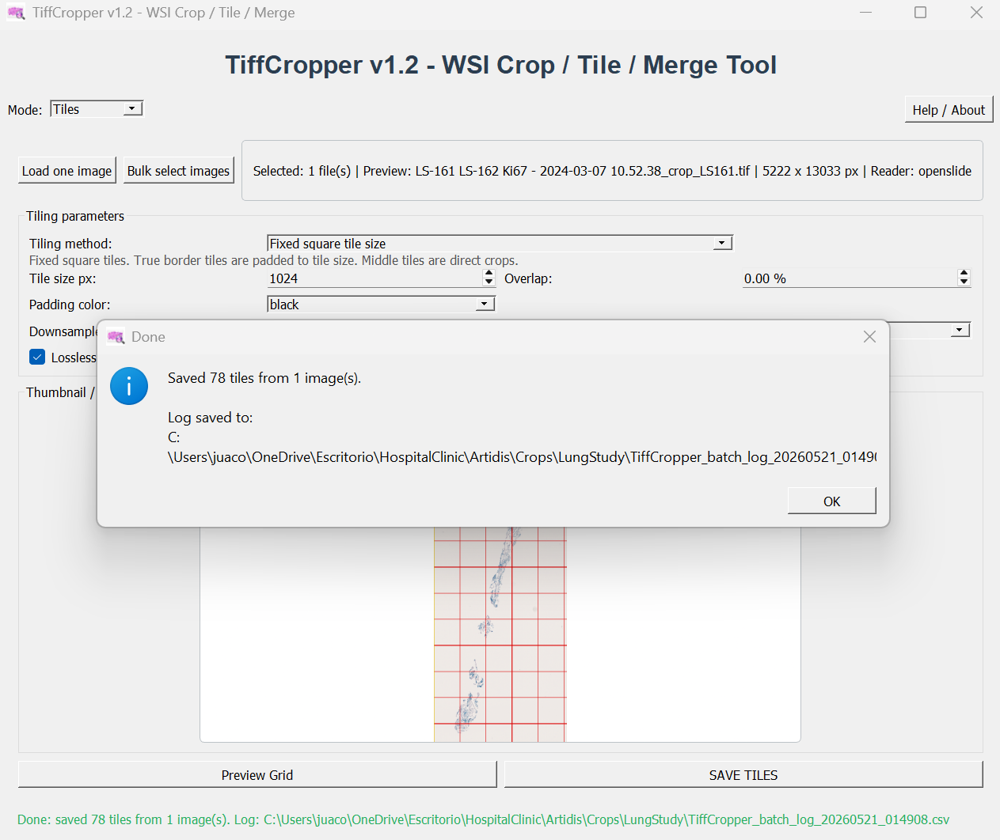

### Merge mode

Merge mode reconstructs images from generated tiles using automatic filename parsing or manual grid assignment.

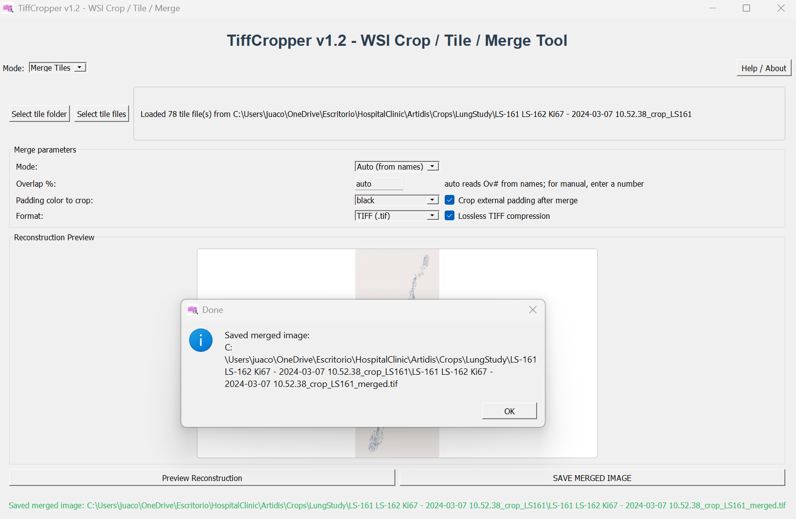

### Windows first-run message

On Windows, unsigned executables downloaded from GitHub may trigger a security warning the first time they are opened. Click **More info** and then **Run anyway** if you trust the downloaded release.

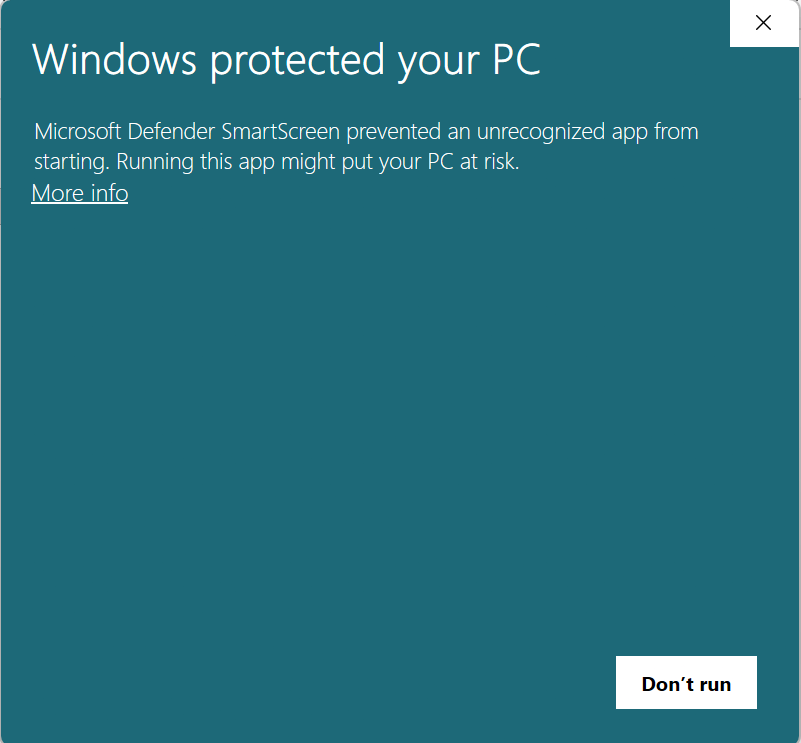

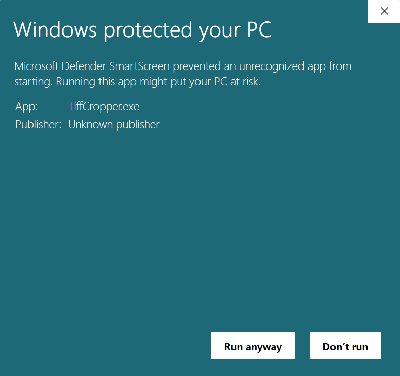

---

## Supported Input Formats

| Format | Backend | Notes |
|---|---|---|
| TIFF / pyramidal TIFF | tifffile / OpenSlide | Pyramid support when available |
| OME-TIFF | tifffile / OpenSlide | Physical pixel size preserved when available |
| SVS | OpenSlide / tifffile fallback | Common digital pathology format |
| NDPI | OpenSlide | Requires OpenSlide support |
| MRXS | OpenSlide | The `.mrxs` file must remain beside its associated data folder |
| SCN / VMS / VMU / BIF / SVSlide | OpenSlide | Support depends on the OpenSlide backend |
| DICOM / DCM | OpenSlide | Support depends on OpenSlide compatibility |
| JPEG / PNG | Pillow | Mainly useful for tiles or simple raster inputs |

---

## Quick Start

1. Download the release artifact for your operating system.
2. Extract the archive.
3. Launch the application:
   - Windows: run `PathoImageToolkit.exe`
   - Linux: run the `PathoImage Toolkit` executable inside the extracted folder
   - macOS: open `PathoImageToolkit.app`, if provided
4. Select a mode from the top menu:
   - `Crop`
   - `Tiles`
   - `Merge Tiles`
5. Load one or more images.
6. Configure parameters.
7. Preview when needed.
8. Save the result.

---

## Crop Mode

Crop mode extracts one ROI from the selected image.

Parameters:

- `X`: left coordinate in pixels.
- `Y`: top coordinate in pixels.
- `Width`: ROI width in pixels.
- `Height`: ROI height in pixels.
- `Select full area`: automatically sets `X=0`, `Y=0`, `Width=image width`, `Height=image height`.
- `Downsample`: default `1`. A value of `2` saves the crop at half width and half height.
- Output format: TIFF, OME-TIFF, or JPEG.

Output examples:

```text
ImageName_crop_final.tif
ImageName_crop_finalDS2.tif
ImageName_crop_ROI1.ome.tif
```

Metadata behavior:

```text
If original pixel size = 0.25 µm/px
and crop downsample = 2
then output pixel size = 0.50 µm/px
```

---

## Tiles Mode

Tiles mode creates tiles from one image or multiple selected images.

### Fixed square tile mode

This mode generates square tiles using a user-defined tile size.

Parameters:

- `Tile size px`: default `1024`.
- `Overlap`: percentage overlap between neighboring tiles. Default `0%`.
- `Downsample`: default `1`. Applied after the original-resolution tile is extracted.
- `Padding`: black or white padding for incomplete border tiles.
- Output format: TIFF or JPEG.

Important behavior:

- Padding is applied only to true border tiles.
- Internal tiles are extracted as direct crops.
- This avoids introducing artificial black or white padding inside the image.

Tiles are saved inside a subfolder with the same name as the image, created beside the input file.

Naming examples:

```text
ImageName_A1.tif
ImageName_B1.tif
ImageName_A2.tif
ImageName_A1Ov10.tif
ImageName_A1Ov10DS2.tif
ImageName_A1_X0_Y0_W1024_H1024.tif
ImageName_A1Ov10DS2_X0_Y0_W1024_H1024.tif
```

Columns use letters (`A`, `B`, `C`, ...), rows use numbers (`1`, `2`, `3`, ...).

### Divide image by rows/columns

In addition to fixed square tiles, PathoImage Toolkit can divide an image into a user-defined number of rows and columns.

This mode:

- Produces tiles that may be rectangular.
- Does not add artificial padding.
- Stores row, column, grid size, and original pixel coordinates in the output names.

Naming examples:

```text
ImageName_R001_C001Div2x2_X0_Y0_W1500_H1500.tif
ImageName_R001_C002Div2x2_X1500_Y0_W1500_H1500.tif
ImageName_R002_C001Div2x2DS2_X0_Y1500_W1500_H1500.tif
```

Metadata behavior:

```text
If original pixel size = 0.25 µm/px
and tile downsample = 2
then tile pixel size = 0.50 µm/px
```

---

## Merge Tiles Mode

Merge mode reconstructs a tiled image.

### Auto mode

Use auto mode when tiles follow the PathoImage Toolkit naming convention:

```text
ImageName_A1.tif
ImageName_B1.tif
ImageName_A2.tif
```

or coordinate-aware names such as:

```text
ImageName_A1_X0_Y0_W1024_H1024.tif
ImageName_B1_X1024_Y0_W1024_H1024.tif
ImageName_A2_X0_Y1024_W1024_H1024.tif
```

If tile names include overlap, for example `Ov10`, the program can read it automatically when overlap is set to `auto`.

### Manual grid mode

Use manual grid mode when tile names do not encode their position.

Workflow:

1. Select tile files or a folder.
2. Choose `Manual grid` mode.
3. Click `Preview Reconstruction`.
4. Enter number of rows and columns.
5. Assign tiles to grid cells manually, or use auto-fill by selected order.
6. Save the merged image.

Manual mode assumes all tiles have the same square size.

### Important note about overlap

The merge operation is geometric. It does not perform image registration or intelligent stitching.

For overlap:

```text
stride = tile_size - overlap_px
```

Neighboring tiles are placed using this stride. In overlapping regions, the later tile overwrites the previous tile.

This works correctly when tiles were generated from the same source image using the same tile size, overlap, and downsample.

### Metadata behavior during merge

Merged TIFF outputs reuse calibration metadata from the first tile when available. This preserves the final tile pixel size in the reconstructed image.

---

## Performance Notes

PathoImage Toolkit is designed for large WSI workflows.

The application uses:

- OpenSlide for WSI formats such as NDPI, SVS, MRXS, SCN, VMS, VMU, BIF, SVSlide, and compatible DICOM files.
- tifffile and zarr-based access for TIFF and OME-TIFF where possible.
- Cached readers during repeated crop/tile operations to avoid reopening large files unnecessarily.
- BigTIFF output for large exported regions.
- Tiled TIFF writing with optional DEFLATE compression.

For very large merge operations, memory use depends on the final reconstructed image size. The merge tool reconstructs the output canvas in memory before saving.

---

## Batch Logs

Batch tiling writes a CSV log file with information such as:

```text
timestamp
operation
status
image
reader
output folder
tiles expected
tiles written
message
```

This helps track successful and failed images during large batch jobs.

---

## Development Setup

Clone the repository:

```bash
git clone https://github.com/Juaco2r/PathoImage-Toolkit.git
cd PathoImage-Toolkit
```

Create and activate a virtual environment:

### Windows

```bat
python -m venv venv
venv\Scripts\activate
```

### Linux / macOS

```bash
python -m venv venv
source venv/bin/activate
```

Install dependencies:

```bash
python -m pip install --upgrade pip
pip install -r requirements.txt
```

Run the app:

### Windows

```bat
python src\pathoimage_toolkit\app.py
```

### Linux / macOS

```bash
python src/pathoimage_toolkit/app.py
```

---

## Windows Executable Build

Recommended: build on Windows 10/11 using Python 3.10 or 3.11.

From the repository root:

```bat
venv\Scripts\activate
build_windows.bat
```

The executable will be created at:

```text
dist\PathoImageToolkit.exe
```

Alternative using the spec file:

```bat
pyinstaller --noconfirm --clean PathoImageToolkit.spec
```

The build script/spec bundles required dependencies, including OpenSlide support and compiled imagecodecs components where configured.

---

## GitHub Actions Builds

The repository can build artifacts for:

- Windows
- Linux
- macOS

The workflow is triggered manually or by version tags:

```text
v*
```

Artifacts are uploaded from GitHub Actions as compressed files such as:

```text
PathoImageToolkit-Windows.zip
PathoImageToolkit-Linux.tar.gz
PathoImageToolkit-macOS.zip
```

---

## Recommended Repository Files

```text
requirements.txt
build_windows.bat
PathoImageToolkit.spec
README.md
LICENSE
CITATION.cff
THIRD_PARTY_NOTICES.md
src/pathoimage_toolkit/app.py
assets/icon/pathoimage.ico
assets/screenshots/
.github/workflows/build-release.yml
```

---

## System Requirements

### Windows executable

- Windows 10 or 11.
- 8 GB RAM minimum.
- 16 GB RAM or more recommended for large WSI.
- Sufficient disk space for large crops, tile sets, or merged outputs.
- No internet connection required after download.

### Linux artifact

- A recent Linux distribution.
- OpenSlide-compatible system libraries.
- Qt/XCB-related libraries required by PyQt5.
- 8 GB RAM minimum; 16 GB or more recommended for large WSI.

### macOS artifact

- Recent macOS version.
- OpenSlide support if working with WSI formats requiring OpenSlide.
- 8 GB RAM minimum; 16 GB or more recommended for large WSI.

### Development/building

- Python 3.10 or 3.11.
- Dependencies listed in `requirements.txt`.

---

## Third-Party Dependencies

This project depends on:

- NumPy
- tifffile
- imagecodecs
- Pillow
- zarr
- numcodecs
- PyQt5
- OpenSlide / openslide-python / openslide-bin
- PyInstaller for building executables

See `THIRD_PARTY_NOTICES.md` for additional information.

---

## Citation

If you use this software, please cite:

Rodriguez-Rojas J. TiffCropper: WSI Crop, Tile and Merge Tool for Digital Pathology Images. Version 1.2. Zenodo; 2026. doi:10.5281/zenodo.20316535

BibTeX-style plain entry:

```text
Rodriguez-Rojas J. TiffCropper: WSI Crop, Tile and Merge Tool for Digital Pathology Images. Version 1.2. Zenodo; 2026. doi:10.5281/zenodo.20316535
```

---

## License

MIT License  
© 2026 José Rodriguez-Rojas

See `LICENSE` for details.
