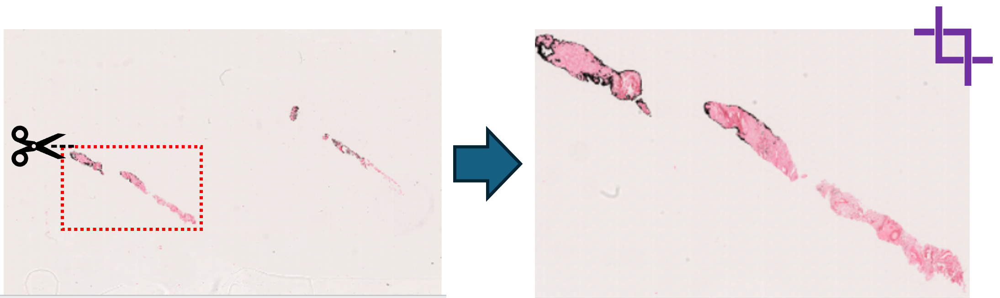
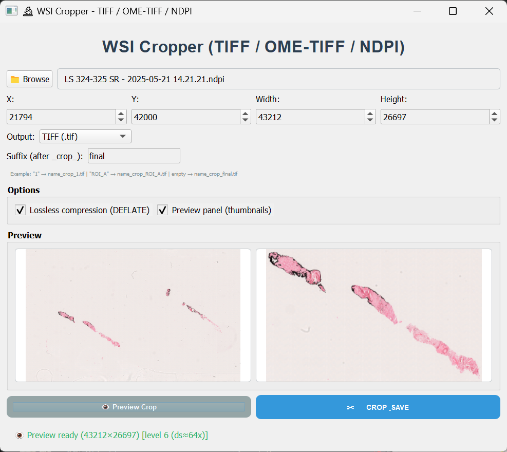

# TiffCropper

### Robust ROI extraction for Whole Slide Images (WSI)

TiffCropper is a standalone Windows application for extracting
high-resolution Regions of Interest (ROIs) from large digital pathology
images while preserving calibration metadata.

It supports:

-   TIFF (.tif, .tiff)
-   OME-TIFF (.ome.tif, .ome.tiff)
-   NDPI (Hamamatsu, via OpenSlide)

The Windows release requires **no Python installation**.


------------------------------------------------------------------------

## 🔬 Why TiffCropper?

Whole Slide Images (WSI) are often multi-gigapixel and difficult to
process interactively.\
TiffCropper enables precise pixel-level ROI extraction while:

-   Preserving physical resolution (DPI / µm per pixel)
-   Supporting OME-TIFF export
-   Handling multi-resolution pyramidal images
-   Writing BigTIFF outputs for large crops
-   Providing interactive preview
-   Recovering from partially corrupted pyramid tiles

Designed for digital pathology and microscopy research workflows.

------------------------------------------------------------------------

## 📥 Download (v1.0)

Go to the **Releases** page and download:

-   `TiffCropper.exe`
-   `TiffCropper_Protocol_v1.0.pdf`

➡ No installation required.\
➡ Fully offline application.

------------------------------------------------------------------------

## 🚀 Quick Start

1.  Launch `TiffCropper.exe`
2.  Click **Browse** and select a WSI file
3.  Enter ROI coordinates:
    -   **X** (horizontal start)
    -   **Y** (vertical start)
    -   **Width**
    -   **Height**
4.  (Optional) Click **Preview Crop**
5.  Click **CROP & SAVE**

Output file naming:

    original_name_crop_suffix.tif
    original_name_crop_suffix.ome.tif

If no suffix is provided, `"final"` is used.



------------------------------------------------------------------------

## 🖼 Supported Formats

  Format     Backend                Notes
  ---------- ---------------------- --------------------------------
  TIFF       tifffile / OpenSlide   Pyramid support when available
  OME-TIFF   tifffile               Physical size preserved
  NDPI       OpenSlide              Multi-level pyramid

------------------------------------------------------------------------

## ⚙ Output Options

### Format

-   TIFF (.tif)
-   OME-TIFF (.ome.tif)

### Compression

Optional **lossless DEFLATE compression** (recommended).

### Large Output Support

-   BigTIFF enabled
-   256×256 tiling
-   RGB photometric format

------------------------------------------------------------------------

## 🔍 Preview System

The preview system:

-   Automatically selects an appropriate pyramid level
-   Downsamples large ROIs for responsiveness
-   Avoids full-resolution decoding during preview
-   Enables interactive ROI refinement

------------------------------------------------------------------------

## 🧠 Robust Cropping Strategy

For OpenSlide-supported formats (NDPI and pyramidal TIFF):

1.  Attempts full-resolution (level 0) block reading.
2.  If decoding fails (e.g., corrupted JPEG tiles):
    -   Reopens the slide handle
    -   Attempts fallback from alternative pyramid levels
    -   Upscales blocks when required
    -   Warns the user if partial recovery was used

This improves reliability when working with imperfect WSI files.

------------------------------------------------------------------------

## 📏 Metadata Preservation

When available, TiffCropper preserves:

-   XResolution
-   YResolution
-   ResolutionUnit
-   Physical pixel size (µm per pixel)

When exporting NDPI → OME-TIFF:

-   OpenSlide properties are embedded as OME MapAnnotations.

------------------------------------------------------------------------

## 🖥 System Requirements

-   Windows 10 / 11
-   ≥ 4 GB RAM (≥ 16 GB recommended for large WSI)
-   Sufficient disk space for large outputs
-   No internet connection required

------------------------------------------------------------------------

## 🧪 Development

Clone repository:

``` bash
git clone https://github.com/Juaco2r/TiffCropper.git
cd TiffCropper
```

Create environment:

``` bash
python -m venv .venv
.venv\Scripts\activate
pip install -r requirements.txt
```

Run:

``` bash
python src/tiffcropper/app.py
```

------------------------------------------------------------------------

## 🏗 Build Windows Executable

Example PyInstaller command:

``` bash
pyinstaller --noconfirm --clean --onefile --windowed ^
  --name TiffCropper ^
  --add-data "<path_to_openslide_bin>;openslide_bin" ^
  src\tiffcropper\app.py
```

Executable will appear in:

    dist/TiffCropper.exe

------------------------------------------------------------------------

## 📘 Documentation

-   Official protocol (PDF): available in the Releases section.
-   Technical documentation (Markdown):
    `protocol/TiffCropper_Protocol.md`

------------------------------------------------------------------------

## ⚖ License

MIT License\
© 2026 Jose Rodriguez-Rojas

See `LICENSE` for details.

------------------------------------------------------------------------

## 📎 Third-Party Notices

This project depends on:

-   NumPy (BSD)
-   tifffile (BSD)
-   Pillow (HPND)
-   zarr (MIT)
-   PyQt5 (GPL/commercial)
-   OpenSlide (LGPL)

See `THIRD_PARTY_NOTICES.md` for additional information.
